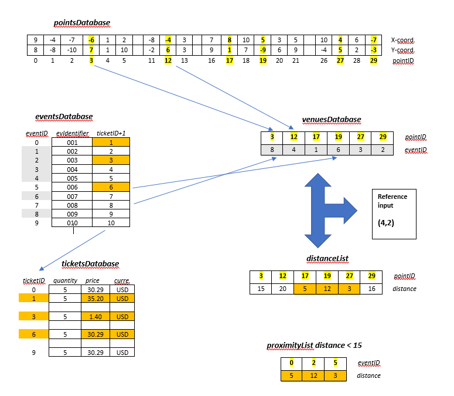
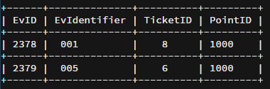

[](https://travis-ci.org/elenamorton/events_manager_js)
[](https://codeclimate.com/github/elenamorton/events_manager_js)
[](https://codeclimate.com/github/elenamorton/events_manager_js/coverage)

# Events manager tech test

## Usage Instructions
* clone the repo and install Node.js modules
```shell
$ git clone https://github.com/elenamorton/events_manager_js.git
$ cd events_manager_js
$ npm install
```
* run tests
```shell
$ npm test
```
* start up the CLI Node application
```shell
$ npm start
```

### Used Technologies
* Vanilla JavaScript ES6
* NodeJS v8.2.1
* Npm v5.3.0
* Test suite based on Mocha(v3.5.0), Chai(v4.1.0)
* Seeded randomizer using Chance(v1.0.10)

### Requirements

Write a program which accepts a user location as a pair of coordinates, and returns a list of the five closest events, along with the cheapest ticket price for each event.

#### Headline specifications

 * The program should randomly generate seed data
 * Program should operate in a world that ranges from -10 to +10 (Y axis), and -10 to +10 (X axis). 
 * Each co-ordinate can hold a maximum of one event
 * Each event has a unique numeric identifier (e.g. 1, 2, 3)
 * Each event has zero or more tickets
 * Each ticket has a non-zero price, expressed in US Dollars
 * The distance between two points should be computed as the Manhattan distance

## Program design

### Assumptions
 * The user is not introducing a reference position out of the [-10..10] range on any of X and Y axis;
 * The 'proximity' algoritm that determins the closest points to the reference location is set as 'less than 15', as a Manhattan distance to the other points;
 * There cannot be duplicated events in the venues hash, or duplicated locations;


### Implementation

 * Each point contains a X-coordinate, and a Y-coordinate;
 * The pointsDatabase is an array of points. A pointID is the index in this array;
 * Only 30 points are randomly generated in order to cover the required 3, 5, and 12 distances; 
 * Each ticket contains the number of tickets available, a price (default is 1), and a currency (default is USD);
 * The ticketsDatabase is an array of tickets. A ticketID is the index in this array;
 * Each event contains an identifier (between 0 and 999), and a ticketID;
 * The eventsDatabase is an array of events. A eventID is the index in this array;
 * Each venue is made up of a hash with the eventID, as key, and a pointID, as value;
 * The venuesDatabase is an object containing the number of venues (as the object length), and hash with available venues;
 * Current implementation contains:  
   - 30 locations (points),
   - 10 tickets types,
   - 10 events, and
   - 6 venues

#### Data structures diagram


### Results

```shell
$ npm start

> event_manager@0.1.0 start /home/ubuntu/workspace
> node app/app.js

Please enter a position (x,y) or <ctrl>D to exit:
> 4,2
Closest events to (4,2):
Event 003 - $30.29, Distance 3
Event 001 - $35.20, Distance 5
Event 006 - $01.40, Distance 12
> end
```
### Task list for the data collections

 - [x] Memory implementation of point, ticket, event, venue collections
 - [ ] Adding nedb lightweight JavaScript database

## Questions

### How might you change your program if you needed to support multiple events at the same location?
- Under current implementation, a simple way is to expand the Venue hash value from a pointID, to an array of pointIDs, 
to allow the multiple locations to be added for an event. The length of the array will give the number of events hold at that location (point);
- A better implementation, would be to change the arrays/hashes implementation to a lightweight database like nedb, and add camo as a data mapper to get the models mapped to database collections.
With this aproach, we only need to add a 'belongs to'-like colomn in the Event model, to contain the pointID from the Points collection. 



### How would you change your program if you were working with a much larger world size?
I would think of several changes that are needed in order to support larger data storage, fast queries, optimisations to avoid often database access.
- Change all data storage from current arrays/hash to a database like MongoDB, to accommodate a larger data collections to be stored in a persistent environment;
- Adding an algorithm to optimize the search times. I would make a list of the 'Five hotest events', and keep it into the memory. This will avoid accessing the database for every query, making the application faster. 
- Replace the simplistic 'proximity' algorithm to a more comprehensive one to take into account serveral criteria. 
  - If two locations have the same Manhattan distance to the reference point, and not both will fit into the 'Five closest', I would consider 'time of travel' for instance, and choose the quickest one into the list. 
  - Expand the input to add 'number of tickets'. If not all of the 'Five closest' events hold the required number of tickets, I would discad them from the list, and search for others further distance, that have the number of tickets required;
  - Maybe, take into account desired facilities at the venue. Venues not meeting the requests will be discarded from the 'Five closest' list. 